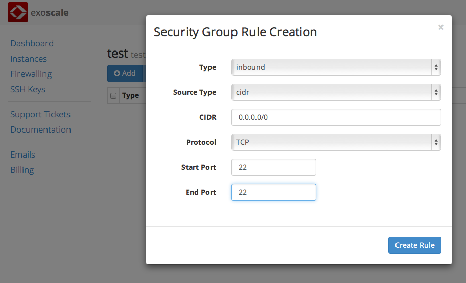

Discover the UI and start an instance 
-------------------------------------
 
Browse the UI, identify the `security groups` and `keypairs` sections.

Create a rule in your default security group to allow inbound traffic on port 22 (ssh)

Create a keypair and store the private key on your machine. CloudStack does not store the private key, so make sure you save it in your `~/.ssh` directory.

Start an instance by clicking on the `Instances` tab and then the `Add` button.

You can then give a name to your instance, select a template, a machine type, a security group and a keypair.

ssh to the instance using the keys that you created earlier:

    ssh -i /path/to/key root@<IP of instance>

